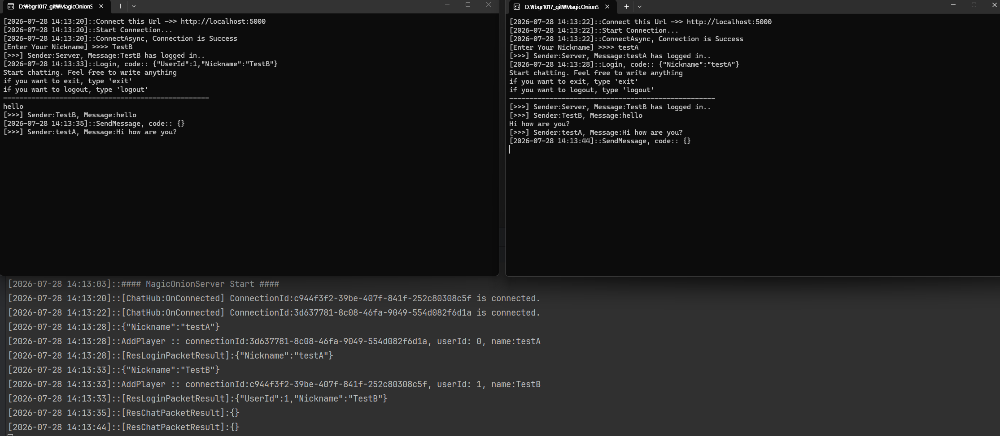
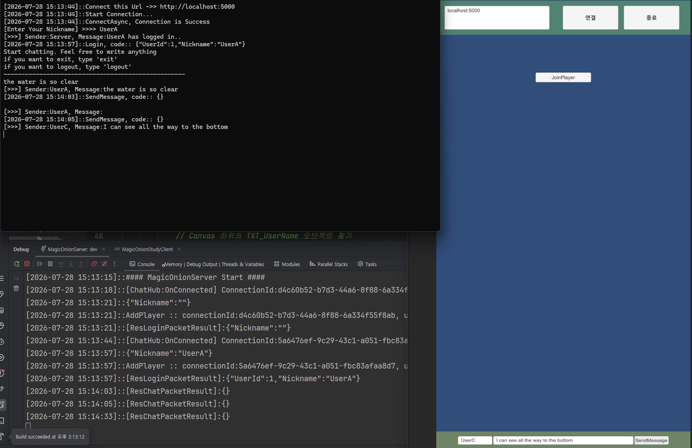

# 🧅 MagicOnionStudy

MagicOnion StreamingHub를 사용해서 .NET 서버, 콘솔 클라이언트, Unity 클라이언트가 같은 Hub 계약으로 통신하는 학습용 프로젝트입니다.

서버는 ASP.NET Core + MagicOnion으로 실행되고, 클라이언트는 로그인, 채팅 메시지 전송, 브로드캐스트 수신, 로그아웃 흐름을 테스트합니다.

## 🛠️ 기술 스택

- ⚙️ .NET 9
- 🌐 ASP.NET Core gRPC
- 🧅 MagicOnion 7.x
- 📦 MemoryPack
- 🎮 Unity 6000.x
- 🔌 NuGetForUnity
- 🚀 YetAnotherHttpHandler

## 📁 프로젝트 구조

```text
.
├─ MagicOnionStudy.sln
├─ MagicOnionStudyServer/        # ASP.NET Core + MagicOnion 서버
├─ MagicOnionStudyClient/        # 콘솔 클라이언트
├─ MagicOnionStudyUnityClient/   # Unity 클라이언트 프로젝트
├─ Common/                       # Shared 네임스페이스, ErrorCode, JSON 유틸
├─ Network/                      # MagicOnion Hub/Receiver 계약
├─ Packets/                      # 요청, 응답, 브로드캐스트 패킷
├─ Shared/                       # 이전 실험용 공유 프로젝트
├─ Directory.Build.props         # 공유 프로젝트 빌드 산출물 위치 설정
└─ _artifacts/                   # Common/Network/Packets 빌드 산출물
```

## 📦 공유 코드와 Unity 패키지

Unity 클라이언트는 다음 세 폴더를 로컬 UPM 패키지로 참조합니다.

```json
"com.magiconion-study.common": "file:../../Common/",
"com.magiconion-study.network": "file:../../Network/",
"com.magiconion-study.packets": "file:../../Packets/"
```

각 폴더에는 Unity가 패키지로 인식할 수 있도록 `package.json`과 `.asmdef`가 있습니다.

- 📘 `Common/package.json`, `Common/Shared.asmdef`
- 📡 `Network/package.json`, `Network/Network.asmdef`
- 🧾 `Packets/package.json`, `Packets/Packets.asmdef`

예전 설정인 `com.magiconion-myproject-server.shared` 또는 `file:../MagicOnionStudy/Shared/`는 현재 구조와 맞지 않습니다.

## ⚠️ Unity C# 버전 주의

Unity는 일반 .NET SDK처럼 최신 C# 문법을 모두 사용할 수 없습니다. 현재 Unity 쪽은 C# 9 기준으로 맞춰야 안전합니다.

Unity가 직접 컴파일하는 `Common`, `Network`, `Packets` 소스에서는 다음을 피합니다.

- 🚫 `global using`
- 🚫 file-scoped namespace: `namespace Packets;`
- 🚫 C# 10 이상 전용 문법
- 🚫 패키지 폴더 안의 `bin/obj` 산출물

그래서 `Common`과 `Network`는 `LangVersion` 9, `ImplicitUsings` disabled로 설정했습니다.

`Packets.csproj`는 .NET 서버 빌드에서 MemoryPack 소스 제너레이터가 C# 11 코드를 생성하기 때문에 `LangVersion` 11을 사용합니다. 대신 Unity가 직접 읽는 `Packets/Packets/*.cs` 파일은 C# 9 문법으로 작성되어 있습니다.

## 🏗️ 빌드 산출물 위치

Unity 로컬 패키지 폴더 안에 `bin` 또는 `obj`가 생기면 Unity가 생성 코드를 같이 컴파일해서 이런 에러가 날 수 있습니다.

```text
Feature 'global using directive' is not available in C# 9.0
Plugin .../obj/Debug/.../Shared.dll has the same filename as Assembly Definition File ...
```

이를 막기 위해 `Directory.Build.props`에서 `Common`, `Network`, `Packets`의 빌드 산출물을 루트 `_artifacts` 폴더로 보냅니다.

```text
_artifacts/bin/Common/
_artifacts/bin/Network/
_artifacts/bin/Packets/
_artifacts/obj/Common/
_artifacts/obj/Network/
_artifacts/obj/Packets/
```

만약 Unity 콘솔에 `Common/obj`, `Packets/obj`, `Network/obj` 관련 에러가 다시 보이면 Unity를 닫고 아래 폴더를 삭제합니다.

```powershell
Remove-Item .\Common\bin, .\Common\obj, .\Network\bin, .\Network\obj, .\Packets\bin, .\Packets\obj -Recurse -Force
```

## 🤝 Hub 계약

클라이언트가 호출하는 Hub 계약은 `Network/Hub/IChatHub.cs`에 있습니다.

```csharp
ValueTask<string> Login(string pkt);
ValueTask<string> SendMessage(string pkt);
ValueTask<string> Logout(string pkt);
```

서버가 클라이언트로 호출하는 Receiver 계약은 `Network/Hub/IChatHubReceiver.cs`에 있습니다.

```csharp
void OnForceClose(ErrorCode errorCode);
void OnSendReceiver(string message);
```

현재 Hub 메서드는 패킷 객체를 직접 넘기지 않고 JSON 문자열을 주고받습니다. JSON 변환은 `Common/Util/Extension.cs`의 `ToJson`, `ToObject<T>`, `ToLogString` 확장 메서드를 사용합니다.

## 📨 패킷

패킷 타입은 `Packets/Packets` 아래에 있습니다.

- 🔐 `ReqLoginPacket`, `ResLoginPacketResult`
- 💬 `ReqChatPacket`, `ResChatPacketResult` 
- 👋 `ReqLogoutPacket`, `ResLogoutPacketResult`
- 📣 `BroadCastPacket`

공통 요청 패킷은 `UserId`, `Nickname`을 가지고, 공통 응답 패킷은 `ErrorCode`, `UserId`, `Nickname`을 가집니다.

## 🖥️ 서버 실행

루트에서 서버를 실행합니다.

```powershell
dotnet run --project .\MagicOnionStudyServer\MagicOnionServer.csproj --launch-profile dev --urls http://localhost:5000
```

또는 먼저 빌드한 뒤 실행합니다.

```powershell
dotnet build .\MagicOnionStudy.sln
dotnet run --project .\MagicOnionStudyServer\MagicOnionServer.csproj --no-build --launch-profile dev --urls http://localhost:5000
```

## 💻 콘솔 클라이언트 실행

서버를 먼저 실행한 뒤 콘솔 클라이언트를 실행합니다.

```powershell
dotnet run --project .\MagicOnionStudyClient\MagicOnionStudyClient.csproj
```

## 🎮 Unity 클라이언트 실행

1. Unity Hub에서 `MagicOnionStudyUnityClient` 폴더를 프로젝트로 엽니다.
2. Unity Package Manager가 `Packages/manifest.json` 기준으로 패키지를 복원할 때까지 기다립니다.
3. NuGetForUnity가 `Assets/packages.config` 기준으로 NuGet 패키지를 복원합니다.
4. 서버를 `http://localhost:5000`으로 실행합니다.
5. Unity Play Mode에서 Connect, Join, SendMessage, Dispose 흐름을 테스트합니다.

주요 Unity 스크립트:

- 🔧 `Assets/Scripts/Initializer.cs`: MagicOnion 클라이언트 생성 및 gRPC 채널 초기화
- 🔗 `Assets/Scripts/Hubs/HubClient.cs`: Hub 연결과 연결 종료 처리
- 📤 `Assets/Scripts/Hubs/HubClient.Request.cs`: Login, SendMessage 요청 전송
- 📥 `Assets/Scripts/Hubs/HubClient.Response.cs`: Receiver 콜백 처리
- 🖱️ `Assets/Scripts/UiManager.cs`: UI 버튼 이벤트 처리
- 🧭 `Assets/Scripts/GameManager.cs`: 수신 메시지와 플레이어 UI 관리

## 🖼️ 구현예시

1. Console 클라이언트에서 서버에 연결하고 채팅 메시지를 주고받는 구현 예시입니다.




2. Console 클라이언트 <-> Unity <-> 서버에 연결하고 채팅 메시지를 주고받는 구현 예시입니다.


